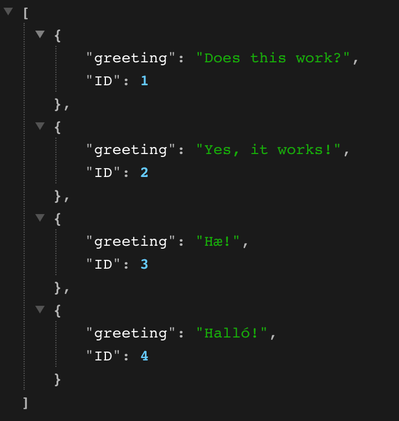

# docker-pern

Trying the pern stack!

In the database (PgAdmin) I have four different greetings that get randomly rendered in the react app. 
 
 
This is what the data looks like on PgAdmin:

 
 
The data pulled from database onto server:

 
 

In the "docker project" folder you will find server.js where you can look at the server that is connected to PgAdmin/Docker.
In the pern-app folder you go to src -> app.js to see how the data is fetched and rendered.

I have comments throughout to explain what I am doing :)
